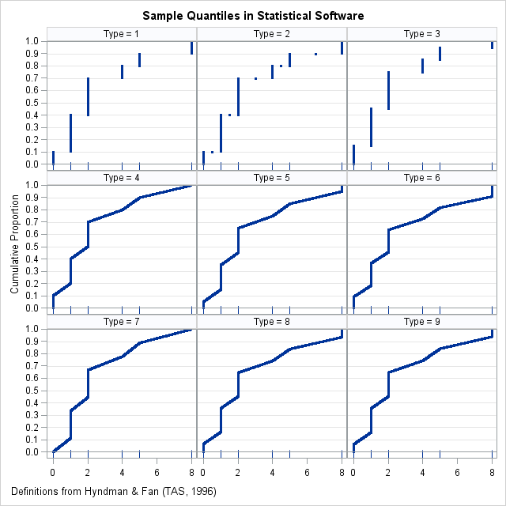

## Exercises

### **12.10** The CPU times in milliseconds for 11 workloads on a processor are 0.74, 0.43, 0.24, 2.24, 262.08, 8960, 4720, 19740, 7360, 22,440, and 28,560. Which index of central tendency would you choose and why?

```{r}
cpu_time <- c(0.74, 0.43, 0.24, 2.24, 262.08, 8960, 4720, 19740, 7360, 22440, 28560)
hist(cpu_time)
```

The histogram above shows the distribution of the measured CPU time. We can see a positive skew.

> If the histogram is skewed, the median is more representative of a typical observation than the mean.

So median is chosen.

```{r}
paste("Median = ", median(cpu_time))
```

```{r}
hist(cpu_time)
abline(v = median(cpu_time), col = "blue", lwd = 3)
```

### **12.11** The number of disk I/O’s performed by a number of programs were measured as follows: {23, 33, 14, 15, 42, 28, 33, 45, 23, 34, 39, 21, 36, 23, 34, 36, 25, 9, 11, 19, 35, 24, 31, 29, 16, 23, 34, 24, 38, 15, 13, 35, 28}. Which index of central tendency would you choose and why?

```{r}
disk_io <- c(23, 33, 14, 15, 42, 28, 33, 45, 23, 34, 39, 21, 36, 23, 34, 36, 25, 9, 11, 19, 35, 24, 31, 29, 16, 23, 34, 24, 38, 15, 13, 35, 28)
hist(disk_io)
```

Distribution is not so skewed so mean is chosen as central tendency index

```{r}
paste("Mean = ", mean(disk_io))
```

```{r}
hist(disk_io)
abline(v = mean(disk_io), col = "red", lwd = 3)
```

### **12.13** For the data of Exercise 12.10, which index of dispersion would you choose and why?

Semi-interquantile range. For the same reason the median was chosen as index of central tendency. The distribution of the data has a positive skewed.

```{r}
paste("Semi-interquantile range = ", IQR(cpu_time)/2)
```

### **12.14** For the data of Exercise 12.11, compute all possible indices of dispersion. Which index would you choose and why?

```{r}
paste("Range = ", range(disk_io))
paste("Standard deviation = ", sd(disk_io))
paste("C.O.V. = ", sd(disk_io) / mean(disk_io) * 100)
paste("Semi-interquantile range = ", IQR(disk_io)/2)
```

The data is not bounded, so a range doesn't make sense. The distribution is symmetrical, so there is no need for SIQR. Finally, I would choose standard deviation as index of dispersion.

### ***13.2*** Answer the following for the data of Exercise 12.11:

#### a. What is the 10-percentile and 90-percentile from the sample?

##### R quantile algorithm types:

10 observations, {0 1 1 1 2 2 2 4 5 8}



Type 1:
Inverse of empirical distribution function.

Type 2:
Similar to type 1 but with averaging at discontinuities.

Type 3: Nearest even order statistic (SAS default till ca. 2010).

```{r}
sapply(1:9, function(x) quantile(disk_io, c(.1, .9), type = x))
```

> The $a-quantile$ is the $[(n - 1)a + 1]$th element.

So the type we want is 1:

```{r}
quantile(disk_io, c(.1, .9), type = 1)
```


#### b. What is the mean number of disk I/O’s per program?

```{r}
mean(disk_io)
```

#### c. What is the 90% confidence interval for the mean?

```{r}
x <- mean(disk_io)
s <- sd(disk_io)
n <- length(disk_io)
a <- 1 - 90/100 
z <- 1.645

# book solution = (24.18, 29.64)
c(x - z*s/sqrt(n), x + z*s/sqrt(n))
```
